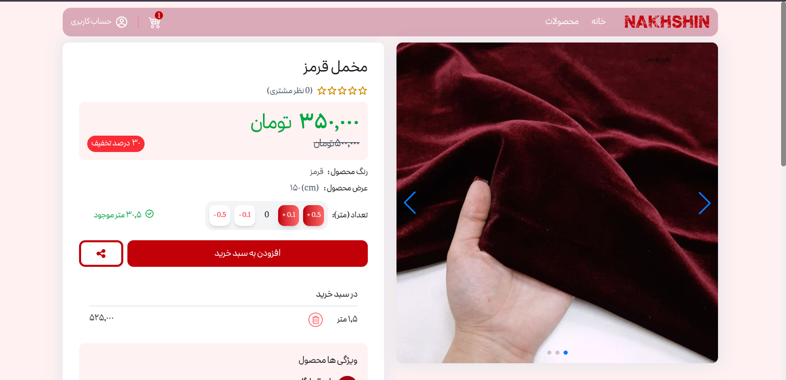
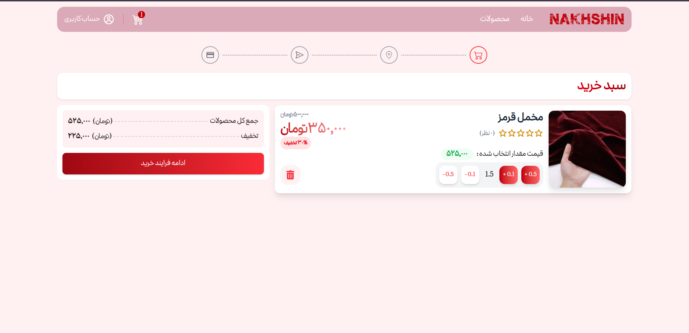

# Fabric Store

Fabric Store is a full-stack e-commerce application for selling fabrics. The project is split into a Next.js frontend and an Express/MongoDB backend.

## ✨ Features

* User Authentication (JWT & Cookies)
* Product Catalog & Search
* Product Details Page
* Shopping Cart & Checkout Flow
* Address Management
* Order Tracking
* Product Comments & Reviews
* Category Management
* Responsive Design
* Payment Integration

## 📸 Screenshots

### Home Page


### Product Details



### Order List




## 🛠️ Tech Stack

### Frontend

* Next.js 15
* React 19
* TypeScript
* Tailwind CSS
* Biome

### Backend

* Node.js
* Express 5
* MongoDB
* Mongoose

### Authentication

* JWT
* HTTP Cookies

### File Uploads

* Multer
* Local File Storage

## 📂 Project Structure

```text
.
├── front/   # Next.js storefront and user flows
└── back/    # Express REST API, MongoDB models, uploads, auth, orders
```

## 🌐 Frontend Routes

* `/` Home Page
* `/products` Product Listing
* `/products/[slug]` Product Details
* `/login`
* `/register`
* `/profile`
* `/profile/addresses`
* `/order/cart`
* `/order/address`
* `/order/shipment`
* `/order/payment`
* `/payment-success`
* `/payment-failed`

## 🔌 Backend API Modules

* Authentication
* Products
* Orders
* Comments
* Users
* Categories
* Navbar Management
* Addresses
* File Uploads
* Payments
* Settings

## ⚙️ Environment Variables

Create a `.env` file inside the `back` directory:

```env
PORT=4000
RUN_MODE=local

MONGODB_URI=<your_mongodb_connection_string>

JWT_SECRET=<your_jwt_secret>
JWT_EXPIRES_IN=7

CLIENT_ORIGINS=http://localhost:3000,http://localhost:4200

PAYMENT_TOKEN=<your_payment_provider_token>
```

### Required Variables

| Variable       | Description               |
| -------------- | ------------------------- |
| PORT           | Backend server port       |
| RUN_MODE       | local or host             |
| MONGODB_URI    | MongoDB connection string |
| JWT_SECRET     | JWT signing secret        |
| JWT_EXPIRES_IN | JWT expiration time       |
| CLIENT_ORIGINS | Allowed frontend origins  |
| PAYMENT_TOKEN  | Payment gateway token     |

## 🚀 Installation

### Frontend

```bash
cd front
npm install
```

### Backend

```bash
cd back
npm install
```

## ▶️ Run Locally

Start backend:

```bash
cd back
npm run dev
```

Start frontend:

```bash
cd front
npm run dev
```

Open:

```text
http://localhost:3000
```

## 🏥 Health Check

```http
GET http://localhost:4000/health
```

## 👨‍💻 Author

**Arshia Zinedine**

GitHub: https://github.com/zArshiaz
